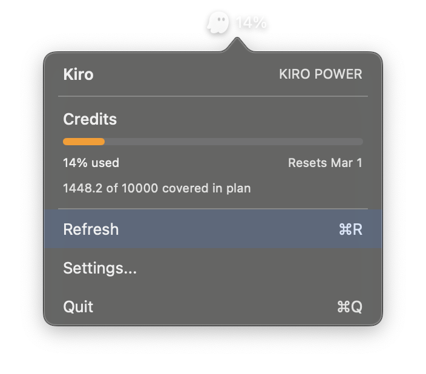

# KiroBar

A minimal macOS menu bar app that displays your [Kiro](https://kiro.dev) usage.

<p align="center">
  
</p>

## Features

- Shows Kiro credits usage percentage in the menu bar
- Displays plan name, credits used/total, and reset date
- Auto-refreshes every 5 minutes
- Native macOS popover UI with progress bar

## Requirements

- macOS 13+
- `kiro-cli` installed and logged in

## Installation

### Download (recommended)
1. Download `KiroBar-macos.zip` from [Releases](https://github.com/nihal111/KiroBar/releases)
2. Unzip and install:
   ```bash
   unzip KiroBar-macos.zip
   sudo mv KiroBar /usr/local/bin/
   ```
3. Run: `/usr/local/bin/KiroBar &`
4. If macOS blocks it: `xattr -d com.apple.quarantine /usr/local/bin/KiroBar`

### Build from source
```bash
git clone https://github.com/nihal111/KiroBar.git
cd KiroBar
swift build -c release
sudo cp .build/release/KiroBar /usr/local/bin/
/usr/local/bin/KiroBar &
```

To launch automatically on login, click the menu bar icon → Settings → enable "Launch at login".

## How it works

- **Usage check**: Runs `kiro-cli chat --no-interactive "/usage"` and parses the output
- **Launch at login**: Creates a LaunchAgent at `~/Library/LaunchAgents/com.kirobar.app.plist`
- **Refresh**: Every 5 minutes, or manually via ⌘R

**Failure modes:**
- If `kiro-cli` isn't installed or not logged in, the menu bar shows ⚠️ and the popover displays the error
- Parsing failures (e.g., output format changes) show a generic error message
- The CLI runs off the main thread; no timeout is set, so a hanging command will block refresh until it completes
- No automatic retries or backoff—just waits for the next 5-minute refresh cycle

## FAQ

**Why not just use CodexBar?**

CodexBar is blocked in some corporate environments (including Amazon). Many Kiro CLI users are internal employees who can't run it. KiroBar is a minimal macOS menu bar alternative that works where CodexBar doesn't.

**Why doesn't `swift test` work?**

XCTest requires Xcode to be installed. To support environments with only Swift CLI tools, tests are built as an executable. Run them with:
```bash
swift build && .build/debug/KiroBarTests
```

## Attribution

This project is inspired by and based on [CodexBar](https://github.com/steipete/CodexBar) by [@steipete](https://github.com/steipete). CodexBar is a comprehensive menu bar app supporting multiple AI providers. KiroBar extracts and simplifies the Kiro-specific functionality into a minimal, standalone app.

## License

MIT
